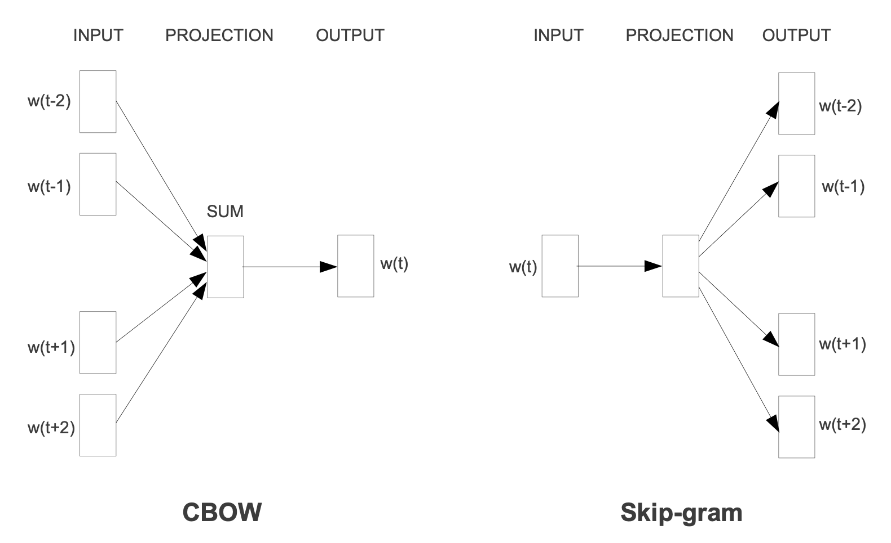

# Must-read paepers in Natural Language Processing

## Word Representation

*(NPLM)* **A Neural Probabilistic Language Model.** Yoshua Bengio, Réjean Ducharme, Pascal Vincent, Christian Jauvin. Journal of Machine Learning Research 2003.

- [[paper](https://www.jmlr.org/papers/volume3/tmp/bengio03a.pdf)]

*(Word2Vec)* **Efficient Estimation of Word Representations in Vector Space.** Tomas Mikolov, Kai Chen, Greg Corrado, Jeffrey Dean. ICLR 2013.

- [[paper](https://arxiv.org/pdf/1301.3781)] [[blog](https://cheris8.github.io/artificial%20intelligence/NLP-WordEmbedding-Word2Vec/)]
- 뉴럴 네트워크를 통해 단어의 분산 표현(distributed representation)을 학습하는 데에 초점

- Continuous Bag-of-Words Model : 주변에 있는 단어들로 중간에 있는 단어를 예측하는 방법
- Continuous Skip-gram Model : 중간에 있는 단어로 주변에 있는 단어들을 예측하는 방법
- word similarity task로 성능 측정

*(GloVe)* **GloVe: Global Vectors for Word Representation.** Jeffrey Pennington, Richard Socher, Christopher D. Manning. EMNLP 2014.

- [[paper](https://nlp.stanford.edu/pubs/glove.pdf)]

*(fastText)* **Enriching Word Vectors with Subword Information.** Piotr Bojanowski, Edouard Grave, Armand Joulin, Tomas Mikolov. ACL 2017.

- [paper](https://arxiv.org/pdf/1607.04606.pdf)

*(ELMo)* **Deep contextualized word representations.** Matthew E. Peters, Mark Neumann, Mohit Iyyer, Matt Gardner, Christopher Clark, Kenton Lee, Luke Zettlemoyer. NAACL 2018.

- [[paper](https://arxiv.org/pdf/1802.05365.pdf)]

*(BERT)* **BERT: Pre-training of Deep Bidirectional Transformers for Language Understanding.** Jacob Devlin, Ming-Wei Chang, Kenton Lee, Kristina Toutanova.

- [[paper](https://arxiv.org/pdf/1810.04805.pdf)]
